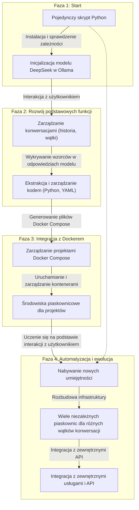

# evopy - Ewolucyjny Asystent dla konwersji text2python

Evopy to kompleksowy, ale minimalny system asystenta, który jest w stanie ewoluować z prostego skryptu konsolowego do pełnego środowiska z wieloma piaskownicami Docker. Asystent wspiera konwersję tekstu na kod Python i zarządzanie projektami w kontenerach Docker.

## Funkcjonalności

- **Automatyczna konfiguracja** - sprawdza i instaluje wymagane zależności (Docker, Ollama, model llama3)
- **Interaktywny chat w konsoli** - prosty i intuicyjny interfejs użytkownika
- **Wykrywanie kodu** - automatycznie identyfikuje i obsługuje kod generowany przez model
- **Zarządzanie projektami** - tworzy i zarządza projektami w kontenerach Docker
- **Ewolucyjny rozwój** - rozbudowuje swoje możliwości w trakcie użytkowania
- **Konwersja tekst-na-kod** - zaawansowany mechanizm konwersji zapytań użytkownika na kod Python
- **Weryfikacja intencji** - automatyczna weryfikacja, czy wygenerowany kod spełnia intencje użytkownika
- **Analiza logiczna kodu** - wykrywanie potencjalnych problemów i sugerowanie ulepszeń w wygenerowanym kodzie
- **Bezpieczne środowisko wykonawcze** - izolowane środowisko Docker do uruchamiania wygenerowanego kodu
- **Autonaprawa zależności** - automatyczne wykrywanie i naprawianie brakujących importów w kodzie
- **Porównywanie modeli LLM** - system testowania i raportowania dla różnych modeli językowych

## Architektura

System został zaprojektowany w oparciu o architekturę ewolucyjną, która rozwija się w miarę użytkowania:




## Struktura projektu

```
evopy/
├── main.py                # Główny punkt wejścia do aplikacji
├── text2python.py         # Moduł konwersji tekstu na kod Python
├── python2text.py         # Moduł konwersji kodu Python na opis tekstowy
├── docker_sandbox.py      # Moduł zarządzania piaskownicami Docker
├── dependency_manager.py  # Moduł zarządzania zależnościami i auto-naprawy importów
├── decision_tree.py       # Moduł drzewa decyzyjnego do śledzenia procesu myślowego
├── test.sh                # Skrypt testowy dla pojedynczego modelu
├── report.sh              # Skrypt generujący raporty porównawcze dla wielu modeli
├── modules/               # Moduły funkcjonalne
│   ├── text2python/       # Moduł konwersji tekstu na kod Python
│   │   ├── __init__.py
│   │   ├── text2python.py
│   │   └── config.py
│   └── python2text/       # Moduł konwersji kodu Python na opis tekstowy
│       ├── __init__.py
│       ├── python2text.py
│       └── config.py
├── tests/                 # Testy
│   ├── correctness/       # Testy poprawności
│   │   ├── correctness_test.py
│   │   └── results/
│   └── performance/       # Testy wydajności
│       ├── performance_test.py
│       └── results/
├── reports/               # Raporty porównawcze modeli
├── test_results/          # Wyniki testów
├── generated_code/        # Wygenerowany kod
├── docker/                # Pliki konfiguracyjne Docker
│   ├── Dockerfile
│   └── docker-compose.yml
├── config/                # Pliki konfiguracyjne
│   └── .env               # Zmienne środowiskowe
├── docs/                  # Dokumentacja
│   ├── project_guidelines.md          # Wytyczne projektu
│   ├── junior_programmer_skills.md    # Umiejętności junior programisty
│   ├── sandbox_architecture.md        # Architektura piaskownic
│   └── TESTING.md                     # Dokumentacja systemu testowego
├── .venv/                 # Wirtualne środowisko Python
└── README.md              # Ten plik
```

## Funkcje i komponenty

### Konwersja tekst-na-kod

1. **Analiza zapytania użytkownika** - przetwarzanie zapytania w języku naturalnym
2. **Generowanie kodu Python** - tworzenie kodu realizującego zapytanie
3. **Weryfikacja intencji** - sprawdzanie, czy kod realizuje intencje użytkownika
4. **Analiza logiczna** - wykrywanie potencjalnych problemów w kodzie
5. **Wykonanie kodu** - uruchomienie kodu w bezpiecznym środowisku
6. **Autonaprawa zależności** - automatyczne wykrywanie i naprawianie brakujących importów

### Zarządzanie projektami Docker

1. **Tworzenie projektów** - generowanie plików Docker Compose
2. **Zarządzanie kontenerami** - uruchamianie, zatrzymywanie i monitorowanie kontenerów
3. **Izolacja środowiska** - bezpieczne wykonywanie kodu w izolowanych kontenerach
4. **Współdzielenie danych** - wymiana danych między kontenerami a hostem
5. **Zarządzanie zależnościami** - automatyczne instalowanie wymaganych pakietów

### Testowanie i optymalizacja

1. Framework testowy umożliwia ocenę wydajności asystenta na różnych zadaniach programistycznych
2. Testy podstawowe sprawdzają umiejętności junior programisty (algorytmy, struktury danych, OOP)
3. Testy złożonych zadań weryfikują zdolność asystenta do rozwiązywania rzeczywistych problemów
4. Analiza architektury porównuje różne podejścia do generowania i wykonywania kodu
5. Raporty z testów pomagają zidentyfikować obszary do optymalizacji i ulepszeń
6. Automatyczne testy zapytań weryfikują poprawność konwersji tekst-na-kod i analizę logiczną

### System testowania i raportowania modeli LLM

Evopy zawiera zaawansowany system testowania i porównywania różnych modeli LLM:

- **test.sh** - skrypt do testowania pojedynczego modelu z interaktywnym wyborem
- **report.sh** - skrypt generujący raporty porównawcze dla wielu modeli
- **Automatyczne wykrywanie dostępnych modeli** - system wykrywa modele dostępne w Ollama
- **Generowanie raportów w formacie Markdown** - przejrzyste raporty z wynikami testów
- **Porównanie wydajności i poprawności** - kompleksowe porównanie różnych modeli

Szczegółowa dokumentacja systemu testowego znajduje się w pliku [docs/TESTING.md](docs/TESTING.md).

### Specyfikacja systemu konwersji tekst-na-kod

System konwersji tekst-na-kod działa w następujących krokach:

#### 1. Konwersja tekstu na kod Python

- **Wejście**: Zapytanie użytkownika w języku naturalnym
- **Proces**: Model językowy analizuje zapytanie i generuje odpowiedni kod Python
- **Wyjście**: Funkcja `execute()` zawierająca kod realizujący zapytanie

#### 2. Weryfikacja intencji użytkownika

- **Wejście**: Wygenerowany kod Python
- **Proces**: Model językowy analizuje kod i generuje jego wyjaśnienie w języku naturalnym
- **Wyjście**: Tekstowe wyjaśnienie działania kodu

#### 3. Analiza logiczna kodu

- **Wejście**: Wygenerowany kod Python i zapytanie użytkownika
- **Proces**: Model językowy przeprowadza analizę logiczną kodu, sprawdzając jego poprawność i zgodność z intencją użytkownika
- **Wyjście**: Raport JSON zawierający pola:
  - `correctness` - ocena poprawności kodu (0-1)
  - `completeness` - ocena kompletności kodu (0-1)
  - `efficiency` - ocena wydajności kodu (0-1)
  - `security` - ocena bezpieczeństwa kodu (0-1)
  - `issues` - lista wykrytych problemów
  - `suggestions` - sugestie ulepszeń

#### 4. Autonaprawa zależności

- **Wejście**: Wygenerowany kod Python
- **Proces**: System analizuje kod i wykrywa brakujące importy
- **Wyjście**: Poprawiony kod z dodanymi importami

### Specyfikacja systemu piaskownic Docker

System piaskownic Docker zapewnia bezpieczne środowisko do wykonywania kodu:

#### 1. Tworzenie piaskownicy

- **Wejście**: Wygenerowany kod Python
- **Proces**: System generuje pliki Docker Compose i konfiguruje środowisko
- **Wyjście**: Gotowa piaskownica Docker

#### 2. Wykonanie kodu

- **Wejście**: Kod Python i piaskownica Docker
- **Proces**: System uruchamia kod w izolowanym kontenerze
- **Wyjście**: Wyniki wykonania kodu

#### 3. Zarządzanie zależnościami

- **Wejście**: Kod Python z zależnościami
- **Proces**: System automatycznie instaluje wymagane pakiety
- **Wyjście**: Środowisko z zainstalowanymi zależnościami

## Wymagania systemowe

- Python 3.8 lub nowszy
- Docker oraz Docker Compose (opcjonalnie, instalowane automatycznie jeśli brakuje)
- Ollama (opcjonalnie, instalowane automatycznie jeśli brakuje)
- Minimum 8GB RAM
- Zalecane: karta graficzna NVIDIA (dla przyśpieszenia inferencji modelu)
- Dostęp do internetu (do pobierania zależności i modeli)

## Instalacja

### Automatyczna instalacja

```bash
# Pobierz repozytorium
git clone https://github.com/tom-sapletta-com/evopy.git
cd evopy

# Uruchom skrypt instalacyjny
./install.sh
```

Skrypt automatycznie:
1. Sprawdzi i zainstaluje wymagane zależności (Python, Docker, Ollama)
2. Utworzy wirtualne środowisko Python
3. Zainstaluje wymagane pakiety Python
4. Pobierze model llama3 do Ollama
5. Skonfiguruje środowisko

### Manualna instalacja

```bash
# Pobierz repozytorium
git clone https://github.com/tom-sapletta-com/evopy.git
cd evopy

# Utwórz wirtualne środowisko Python
python -m venv .venv
source .venv/bin/activate  # Linux/Mac
# lub
# .venv\Scripts\activate  # Windows

# Zainstaluj zależności
pip install -r requirements.txt

# Zainstaluj Ollama (jeśli nie jest zainstalowany)
# Instrukcje: https://github.com/ollama/ollama

# Pobierz model llama3
ollama pull llama3
```

## Użycie

### Podstawowe użycie

```bash
# Aktywuj wirtualne środowisko
source .venv/bin/activate  # Linux/Mac
# lub
# .venv\Scripts\activate  # Windows

# Uruchom asystenta
python main.py
```

### Uruchamianie testów

```bash
# Uruchom testy dla pojedynczego modelu z interaktywnym wyborem
./test.sh

# Uruchom testy dla konkretnego modelu
./test.sh --model=llama

# Wygeneruj raport porównawczy dla wszystkich dostępnych modeli
./report.sh
```

### Tryb deweloperski

```bash
# Tworzenie środowiska deweloperskiego
conda env create -f environment.yml
conda activate evopy

# Instalacja w trybie deweloperskim
pip install -e .
```

## Licencja

Ten projekt jest udostępniany na licencji Apache 2.0. Szczegóły w pliku [LICENSE](LICENSE).

## Autorzy

- Tom Sapletta - Pomysłodawca i główny deweloper

## Podziękowania

- Zespół Ollama za świetne narzędzie do lokalnego uruchamiania modeli LLM
- Zespół DeepSeek za model DeepSeek Coder
- Zespół Meta AI za model Llama 3
- Zespół Bielik za pomoc i wsparcie na Discord


- Windsurf za czujność:
