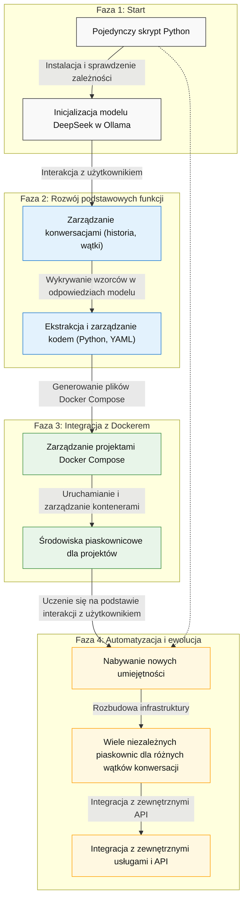

# evopy - Ewolucyjny Asystent dla konwersji text2python

Evopy to kompleksowy, ale minimalny system asystenta, który jest w stanie ewoluować z prostego skryptu konsolowego do pełnego środowiska z wieloma piaskownicami Docker. Asystent wspiera konwersję tekstu na kod Python i zarządzanie projektami w kontenerach Docker.

## Funkcjonalności

- **Automatyczna konfiguracja** - sprawdza i instaluje wymagane zależności (Docker, Ollama, model llama3)
- **Interaktywny chat w konsoli** - prosty i intuicyjny interfejs użytkownika
- **Wykrywanie kodu** - automatycznie identyfikuje i obsługuje kod generowany przez model
- **Zarządzanie projektami** - tworzy i zarządza projektami w kontenerach Docker
- **Ewolucyjny rozwój** - rozbudowuje swoje możliwości w trakcie użytkowania
- **Konwersja tekst-na-kod** - zaawansowany mechanizm konwersji zapytań użytkownika na kod Python
- **Weryfikacja intencji** - automatyczna weryfikacja, czy wygenerowany kod spełnia intencje użytkownika
- **Analiza logiczna kodu** - wykrywanie potencjalnych problemów i sugerowanie ulepszeń w wygenerowanym kodzie
- **Bezpieczne środowisko wykonawcze** - izolowane środowisko Docker do uruchamiania wygenerowanego kodu
- **Autonaprawa zależności** - automatyczne wykrywanie i naprawianie brakujących importów w kodzie

## Architektura

System został zaprojektowany w oparciu o architekturę ewolucyjną, która rozwija się w miarę użytkowania:




1. **Faza początkowa**: Prosty interfejs konsolowy + model DeepSeek
2. **Rozwój funkcji**: Zarządzanie konwersacjami i wykrywanie kodu w odpowiedziach
3. **Integracja z Dockerem**: Tworzenie i zarządzanie projektami Docker Compose
4. **Automatyzacja i rozszerzenia**: Nabywanie nowych umiejętności i integracje z API

## Struktura projektu

Evopy jest dostępny zarówno jako pojedynczy skrypt, jak i jako pełnoprawny pakiet Python:

```
evopy/
├── evopy/                 # Katalog pakietu Python
│   ├── __init__.py        # Inicjalizacja pakietu
│   ├── evo.py             # Główny moduł asystenta
│   ├── text2python.py     # Moduł konwersji tekstu na kod Python
│   ├── docker_sandbox.py  # Moduł piaskownicy Docker
│   └── monitor.py         # Moduł monitorowania i debugowania
├── tests/                 # Katalog testów
│   ├── test_assistant_performance.py  # Testy wydajności asystenta
│   ├── test_complex_tasks.py          # Testy złożonych zadań
│   ├── analyze_architecture.py        # Analiza architektury
│   ├── run_performance_tests.py       # Skrypt uruchamiający testy
│   ├── run_all_tests.py               # Skrypt uruchamiający wszystkie testy
│   ├── README.md                      # Dokumentacja testów
│   ├── results/                       # Katalog wyników testów
│   └── reports/                       # Katalog raportów z testów
├── docs/                  # Dokumentacja
│   ├── project_guidelines.md          # Wytyczne projektu
│   ├── junior_programmer_skills.md    # Umiejętności junior programisty
│   └── sandbox_architecture.md        # Architektura piaskownic
├── .venv/                 # Wirtualne środowisko Python
├── evo.py                # Główny plik asystenta
├── text2python.py        # Moduł konwersji tekst-na-kod
├── docker_sandbox.py     # Moduł piaskownicy Docker
├── dependency_manager.py # Moduł autonaprawy zależności
├── test_queries.py       # Testy podstawowych zapytań
├── pyproject.toml        # Konfiguracja pakietu
├── environment.yml       # Konfiguracja środowiska Conda
├── requirements.txt      # Zależności Python
├── install.sh            # Skrypt instalacyjny
├── run.sh                # Skrypt uruchomieniowy
├── debug.sh              # Skrypt debugowania
└── test.sh               # Skrypt testowy
```

## Framework testowy

Evopy zawiera kompleksowy framework testowy do oceny wydajności asystenta i optymalizacji jego architektury:

### Komponenty frameworku testowego

1. **Testy podstawowe** (`test_assistant_performance.py`)
   - Testuje zdolność asystenta do obsługi podstawowych zadań programistycznych
   - Obejmuje programowanie podstawowe, struktury danych, OOP, algorytmy, przetwarzanie tekstu itp.
   - Mierzy współczynnik sukcesu i czasy wykonania

2. **Testy złożonych zadań** (`test_complex_tasks.py`)
   - Testuje bardziej zaawansowane scenariusze wymagające wielu umiejętności
   - Obejmuje tworzenie aplikacji webowych, analizę danych, przetwarzanie obrazów, wielowątkowość itp.
   - Ocenia zdolność asystenta do radzenia sobie z rzeczywistymi wyzwaniami programistycznymi

3. **Analiza architektury** (`analyze_architecture.py`)
   - Porównuje różne podejścia do wykonywania złożonych zadań:
     - Podejście bezpośrednie (generowanie jednoetapowe)
     - Podejście iteracyjne (z korekcją błędów)
     - Podejście modułowe (dzielenie zadań na komponenty)
   - Określa, które podejście jest najskuteczniejsze dla różnych typów zadań

4. **Skrypty uruchamiające testy**
   - `run_performance_tests.py`: Uruchamia podstawowe testy z wizualizacją
   - `run_all_tests.py`: Orkiestruje wszystkie testy i generuje raport podsumowujący

### Jak korzystać z frameworku testowego

Wszystkie testy można uruchomić z wirtualnego środowiska:

```bash
# Aktywuj środowisko wirtualne
source .venv/bin/activate

# Uruchom wszystkie testy
python tests/run_all_tests.py

# Uruchom określone typy testów
python tests/run_all_tests.py --skip-complex --skip-architecture  # Tylko testy podstawowe
python tests/test_complex_tasks.py  # Tylko testy złożonych zadań
python tests/analyze_architecture.py  # Tylko analiza architektury
```

Testy generują szczegółowe raporty w formacie HTML z wizualizacjami pokazującymi metryki wydajności w różnych kategoriach zadań.

## Kluczowe funkcjonalności

- **Zarządzanie konwersacjami**: Każda konwersacja jest osobnym wątkiem z własną historią
- **Wykrywanie kodu w odpowiedziach**: Automatyczne wykrywanie bloków kodu Python i Docker Compose
- **Tworzenie piaskownic Docker**: Możliwość tworzenia i zarządzania piaskownicami dla każdej konwersacji
- **Uruchamianie wygenerowanego kodu**: Bezpieczne środowisko dla testowania kodu
- **Interaktywny interfejs konsolowy**: Prosty, ale funkcjonalny interfejs z kolorowymi komunikatami
- **Konwersja tekstu na kod Python**: Automatyczna konwersja zapytań użytkownika na funkcje Python
- **Piaskownica Docker**: Bezpieczne środowisko do uruchamiania wygenerowanego kodu

## 4. Jak to działa

1. Użytkownik uruchamia skrypt `python evo.py`
2. Asystent instaluje niezbędne zależności i uruchamia model DeepSeek w Ollama
3. Użytkownik prowadzi konwersację, a asystent wykrywa kiedy generowany jest kod:
   - Dla bloków Docker Compose → proponuje utworzenie projektu
   - Dla bloków Python → proponuje zapisanie skryptu i ewentualne wykonanie
4. Zapytania użytkownika są konwertowane na funkcje Python przez moduł `text2python.py`
5. Wygenerowany kod jest uruchamiany w bezpiecznym środowisku Docker przez moduł `docker_sandbox.py`
6. Wyniki wykonania kodu są zwracane do użytkownika
7. Z każdą konwersacją asystent zwiększa swoje możliwości, budując infrastrukturę projektów

### Testowanie i optymalizacja

1. Framework testowy umożliwia ocenę wydajności asystenta na różnych zadaniach programistycznych
2. Testy podstawowe sprawdzają umiejętności junior programisty (algorytmy, struktury danych, OOP)
3. Testy złożonych zadań weryfikują zdolność asystenta do rozwiązywania rzeczywistych problemów
4. Analiza architektury porównuje różne podejścia do generowania i wykonywania kodu
5. Raporty z testów pomagają zidentyfikować obszary do optymalizacji i ulepszeń
6. Automatyczne testy zapytań weryfikują poprawność konwersji tekst-na-kod i analizę logiczną

### Specyfikacja systemu konwersji tekst-na-kod

System konwersji tekst-na-kod działa w następujących krokach:

#### 1. Konwersja tekstu na kod Python

- **Wejście**: Zapytanie użytkownika w języku naturalnym
- **Proces**: Model językowy analizuje zapytanie i generuje odpowiedni kod Python
- **Wyjście**: Funkcja `execute()` zawierająca kod realizujący zapytanie

#### 2. Weryfikacja intencji użytkownika

- **Wejście**: Wygenerowany kod Python
- **Proces**: Model językowy analizuje kod i generuje jego wyjaśnienie w języku naturalnym
- **Wyjście**: Tekstowe wyjaśnienie działania kodu

#### 3. Analiza logiczna kodu

- **Wejście**: Wygenerowany kod Python i zapytanie użytkownika
- **Proces**: Model językowy przeprowadza analizę logiczną kodu, sprawdzając jego poprawność i zgodność z intencją użytkownika
- **Wyjście**: Raport JSON zawierający pola:
  - `is_logical` (bool): Czy kod jest logiczny
  - `matches_intent` (bool): Czy kod realizuje intencję użytkownika
  - `issues` (lista): Wykryte problemy
  - `suggestions` (lista): Sugestie ulepszeń

#### 4. Autonaprawa zależności

- **Wejście**: Wygenerowany kod Python
- **Proces**: System analizuje kod, wykrywa brakujące importy i automatycznie je dodaje
- **Wyjście**: Kod z uzupełnionymi importami

#### 5. Wykonanie kodu w piaskownicy

- **Wejście**: Wygenerowany kod Python z naprawionymi zależnościami
- **Proces**: Kod jest uruchamiany w izolowanym środowisku Docker z mechanizmem dynamicznego importowania modułów
- **Wyjście**: Wynik wykonania kodu lub komunikat o błędzie

### System autonaprawy zależności

System Evopy zawiera zaawansowany mechanizm autonaprawy zależności, który zapewnia, że wygenerowany kod będzie działał poprawnie, nawet jeśli brakuje w nim niezbędnych importów. System działa na dwóch poziomach:

#### 1. Statyczna analiza kodu (moduł `dependency_manager.py`)

- **Analiza AST** - system analizuje drzewo składni abstrakcyjnej (AST) kodu, aby wykryć używane moduły
- **Analiza wzorcowa** - system używa wyrażeń regularnych do wykrywania potencjalnych odwołań do modułów
- **Baza modułów** - system zawiera bazę standardowych modułów Python i popularnych bibliotek
- **Inteligentne wstawianie** - system dodaje brakujące importy w odpowiednim miejscu kodu

#### 2. Dynamiczna naprawa w czasie wykonania

- **Automatyczne importowanie** - system automatycznie importuje standardowe moduły na początku wykonania kodu
- **Obsługa wyjątków ImportError** - w przypadku wystąpienia błędu importu, system próbuje dynamicznie zaimportować brakujący moduł
- **Ponowne wykonanie** - po dynamicznym zaimportowaniu brakującego modułu, system ponownie próbuje wykonać kod
- **Diagnostyka błędów** - system generuje szczegółowe komunikaty o błędach związanych z zależnościami

Dzięki temu mechanizmowi, użytkownicy nie napotykają błędów typu `name 'time' is not defined` i innych problemów związanych z brakującymi importami.

### Testy systemu

System zawiera automatyczne testy, które weryfikują poprawność działania konwersji tekst-na-kod:

1. **Test prostych zapytań tekstowych** - sprawdza konwersję prostych zapytań na kod Python
2. **Test zapytań matematycznych** - weryfikuje poprawność generowania kodu dla obliczeń matematycznych
3. **Test przetwarzania tekstu** - sprawdza generowanie kodu do manipulacji tekstem

Testy można uruchomić przed startem systemu za pomocą skryptu `test.sh`:

```bash
./test.sh
```

Wyniki testów są zapisywane w pliku `test_results.json` i zawierają szczegółowe informacje o każdym teście, w tym wygenerowany kod i jego wyjaśnienie.

## Zalety tego rozwiązania

1. **Minimalizm**: Startuje jako pojedynczy plik Python
2. **Samowystarczalność**: Sam instaluje potrzebne zależności
3. **Ewolucyjność**: Rozwija się w miarę używania
4. **Elastyczność**: Może pracować z różnymi modelami DeepSeek dostępnymi przez Ollama
5. **Niezależność wątków**: Każda konwersacja może mieć własne projekty i piaskownice
6. **Testowalna architektura**: Kompleksowy framework testowy do oceny wydajności i optymalizacji
7. **Bezpieczne wykonanie kodu**: Izolowane środowisko Docker do uruchamiania wygenerowanego kodu
8. **Modułowa konstrukcja**: Łatwa rozbudowa i dostosowanie do różnych potrzeb

## Korzystanie z systemu

Pobierz wygenerowany plik `evo.py`, zainstaluj podstawowe wymagania (`pip install httpx readline`) i uruchom go. Asystent sam przeprowadzi Cię przez proces instalacji i konfiguracji, a następnie będzie ewoluował w miarę Twoich potrzeb.


# Instrukcja instalacji i użytkowania

## Wymagania systemowe

- Python 3.8 lub nowszy
- Docker oraz Docker Compose (opcjonalnie, instalowane automatycznie jeśli brakuje)
- Ollama (opcjonalnie, instalowane automatycznie jeśli brakuje)
- Minimum 8GB RAM
- Zalecane: karta graficzna NVIDIA (dla przyśpieszenia inferencji modelu)
- Dostęp do internetu (do pobierania zależności i modeli)

## Instalacja

### Opcja 1: Standardowa instalacja

#### Krok 1: Pobierz skrypt

Najpierw zapisz kod asystenta do pliku `evo.py`:

```bash
# Pobierz plik evo.py
curl -o evo.py https://raw.githubusercontent.com/tom-sapletta-com/evopy/main/evo.py
# lub skopiuj kod z artefaktu evopy
```

#### Krok 2: Zainstaluj wymagane pakiety Python

```bash
pip install httpx readline
```

#### Krok 3: Uruchom skrypt

```bash
python evo.py
```

### Opcja 2: Instalacja jako pakiet z Miniconda

#### Krok 1: Sklonuj repozytorium

```bash
git clone https://github.com/tom-sapletta-com/evopy.git
cd evopy
```

#### Krok 2: Utwórz środowisko Conda i zainstaluj pakiet

```bash
# Utwórz środowisko z pliku environment.yml
conda env create -f environment.yml

# Aktywuj środowisko
conda activate evopy
```

#### Krok 3: Uruchom asystenta

```bash
# Uruchom bezpośrednio jako moduł
python -m evopy.evo

# Lub użyj skryptu wejściowego (po instalacji)
evopy

# Z automatycznym akceptowaniem wszystkich pytań (przydatne w środowiskach nieinteraktywnych)
python -m evopy.evo --auto-accept
```

### Opcja 3: Instalacja z użyciem skryptu instalacyjnego

Możesz również użyć dołączonego skryptu instalacyjnego, który przeprowadzi Cię przez proces konfiguracji:

```bash
# Nadaj uprawnienia wykonywania
chmod +x install.sh

# Uruchom skrypt instalacyjny
./install.sh
```

Skrypt instalacyjny:
- Sprawdzi wymagania systemowe
- Utworzy potrzebne katalogi
- Zainstaluje zależności Python
- Skonfiguruje skrypty uruchomieniowe

Przy pierwszym uruchomieniu asystent:
1. Sprawdzi wymagane zależności (Docker, Ollama)
2. Zaproponuje instalację brakujących komponentów
3. Pobierze i zainstaluje model DeepSeek Coder
4. Utworzy strukturę katalogów do przechowywania historii konwersacji i projektów

## Użytkowanie

### Podstawowe komendy

- **Wpisz zapytanie** - aby komunikować się z modelem
- **/help** - wyświetla dostępne komendy
- **/new** - tworzy nową konwersację
- **/list** - wyświetla listę konwersacji
- **/projects** - wyświetla projekty w aktualnej konwersacji
- **/docker ps** - wyświetla listę uruchomionych kontenerów
- **/exit** lub **/quit** - kończy działanie asystenta

### Tworzenie projektów

Możesz tworzyć projekty na dwa sposoby:

1. **Automatycznie poprzez konwersację** - gdy asystent wygeneruje kod w odpowiedzi, automatycznie zapyta o utworzenie projektu
2. **Ręcznie poprzez komendy** - możesz użyć poleceń do zarządzania projektami

### Przykładowe scenariusze użycia

#### 1. Tworzenie prostego projektu Docker Compose

```
> Stwórz prosty projekt Docker Compose z bazą danych PostgreSQL i aplikacją Flask
```

Asystent wygeneruje kod Docker Compose i zapyta czy chcesz go zapisać jako projekt. Po potwierdzeniu:
1. Utworzy katalog projektu
2. Zapisze plik docker-compose.yml
3. Zapyta czy chcesz uruchomić projekt

#### 2. Rozwijanie istniejącego projektu

```
> Dodaj do mojego projektu usługę Redis jako cache
```

Asystent przeanalizuje istniejący projekt i wygeneruje zmodyfikowaną wersję pliku Docker Compose z dodaną usługą Redis.

#### 3. Generowanie kodu Python na podstawie opisu

```
> Napisz kod w Pythonie, który łączy się z bazą danych Postgres i tworzy prostą tabelę
```

Asystent wygeneruje odpowiedni kod Python i zapyta czy chcesz go zapisać w pliku oraz w którym projekcie.

## Proces ewolucji asystenta

Asystent ewoluuje w następujących fazach:

1. **Faza początkowa**: Prosty interfejs konwersacyjny z modelem DeepSeek
2. **Rozwijanie umiejętności**: Tworzenie i zarządzanie projektami Docker Compose
3. **Integracja z infrastrukturą**: Budowanie piaskownic dla każdej konwersacji
4. **Zaawansowane funkcje**: Integracja z zewnętrznymi API i automatyzacja złożonych zadań

Za każdym razem, gdy asystent identyfikuje nowy wzorzec lub potrzebę, rozwija odpowiednią funkcjonalność.

## Struktura katalogów danych

Po instalacji i pierwszym uruchomieniu, evopy tworzy następującą strukturę katalogów w katalogu domowym użytkownika:

```
~/.evo-assistant/
├── cache/              # Pliki tymczasowe
├── history/            # Historia konwersacji
├── models/             # Dane modeli
├── projects/           # Projekty użytkownika
│   └── [project-id]/   # Katalog konkretnego projektu
└── config.json         # Plik konfiguracyjny
```

## Rozwój i kontrybucja

### Rozwijanie pakietu

Jeśli chcesz rozwijać pakiet evopy, zalecamy użycie trybu deweloperskiego:

```bash
# Klonowanie repozytorium
git clone https://github.com/tom-sapletta-com/evopy.git
cd evopy

# Tworzenie środowiska deweloperskiego
conda env create -f environment.yml
conda activate evopy

# Instalacja w trybie deweloperskim
pip install -e .
```

### Testowanie

Możesz uruchomić testy za pomocą skryptu test.sh:

```bash
./test.sh
```

Lub bezpośrednio za pomocą pytest:

```bash
python -m pytest
```

### Debugowanie

Do debugowania możesz użyć skryptu debug.sh lub bezpośrednio modułu monitor.py:

```bash
# Za pomocą skryptu
./debug.sh

# Lub bezpośrednio
python -m evopy.monitor --script ./evopy/evo.py
```

## Rozwiązywanie problemów

### Automatyczna naprawa zależności

System Evopy zawiera wbudowany mechanizm autonaprawy zależności, który automatycznie rozwiązuje większość problemów związanych z brakującymi importami. Jeśli jednak nadal występują problemy, możesz:

1. Sprawdzić logi błędów w katalogu `logs/`
2. Zweryfikować, czy wszystkie wymagane pakiety są zainstalowane: `pip install -r requirements.txt`
3. Uruchomić system w trybie debugowania: `./debug.sh`

#### Typowe problemy z zależnościami

- **Błąd `name 'X' is not defined`** - System powinien automatycznie naprawić ten błąd. Jeśli nadal występuje, dodaj ręcznie brakujący import na początku kodu.
- **Błąd `ImportError: No module named X`** - Sprawdź, czy moduł jest dostępny w środowisku Python. Możesz go zainstalować za pomocą `pip install X`.
- **Błędy w piaskownicy Docker** - Sprawdź, czy Docker jest poprawnie skonfigurowany i ma dostęp do internetu, aby pobrać potrzebne pakiety.

### Problemy z uruchomieniem modelu

Jeśli wystąpią problemy z uruchomieniem modelu llama3, spróbuj:

```bash
# Zatrzymaj wszystkie kontenery Ollama
docker stop $(docker ps -q --filter ancestor=ollama/ollama)

# Sprawdź czy Ollama działa lokalnie
ollama list

# Jeśli nie działa, uruchom ręcznie
ollama serve
```

### Problemy z projektem Docker Compose

Jeśli projekt Docker Compose nie uruchamia się poprawnie:

```bash
# Przejdź do katalogu projektu
cd ~/.evopy/projects/[project-id]

# Sprawdź logi
docker compose logs

# Zatrzymaj i usuń kontenery
docker compose down
```

## Rozszerzanie funkcjonalności

Asystent jest zaprojektowany, aby rozszerzać swoją funkcjonalność w oparciu o konwersacje. Możesz poprosić go o dodanie nowych umiejętności, na przykład:

```
> Naucz się integrować z API zewnętrznej usługi
```

lub

```
> Stwórz funkcję do automatycznego generowania testów jednostkowych dla moich skryptów Python
```

Asystent wygeneruje odpowiedni kod, który możesz dodać do jego bazy umiejętności.

## Zaawansowane użycie

### Tworzenie własnych szablonów projektów

Możesz tworzyć własne szablony projektów, które asystent będzie używał jako podstawę dla nowych projektów:

```
> Stwórz szablon projektu Django z bazą danych Postgres i Redis
```

### Integracja z zewnętrznymi API

Asystent może integrować się z różnymi API:

```
> Stwórz projekt, który będzie pobierał dane z API GitHub i zapisywał je w bazie danych
```

## Uwagi bezpieczeństwa

- Asystent uruchamia kod w izolowanych środowiskach Docker, ale zawsze sprawdzaj wygenerowany kod przed uruchomieniem
- Nie uruchamiaj niezweryfikowanego kodu na serwerach produkcyjnych
- Nie udostępniaj wrażliwych danych asystentowi

## Licencja

Ten projekt jest udostępniany na otwartej licencji Apache 2. Możesz go używać, modyfikować i rozpowszechniać zgodnie z warunkami licencji.