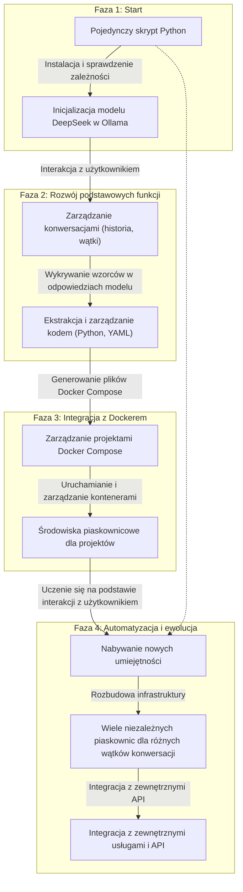
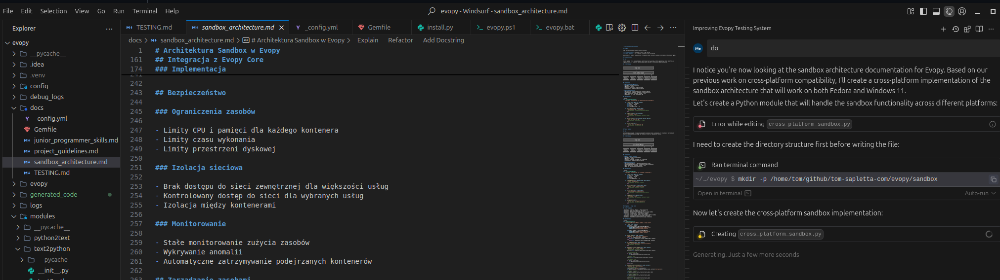

# Devopy - Modularny asystent AI do automatyzacji kodu

Devopy to modularny system AI do automatyzacji zadań programistycznych, konwersji tekstu na kod, zarządzania zależnościami i uruchamiania modularnych bibliotek Python. Pozwala na interaktywną pracę w shellu, automatyczną instalację wymaganych modułów oraz szybkie prototypowanie, testowanie i integrację z narzędziami DevOps.

**Główne możliwości Devopy:**

- Interaktywny shell z automatyczną instalacją zależności Python
- Modularna architektura: każda funkcjonalność jako osobna paczka (np. text2python, python2text, text2shell)
- Automatyczne zarządzanie środowiskiem wirtualnym i katalogiem zależności
- Przykłady użycia: generowanie kodu, konwersje, automatyzacja poleceń shell, obsługa wielu języków
- Integracja z LLM (np. DeepSeek, Ollama) do generowania i poprawy kodu

## Jak zacząć?

### 1. Wymagania
- Python 3.8+
- Docker (jeśli chcesz używać sandboxa Docker)
- Flask (do API):
  ```bash
  pip install flask
  ```

### 2. Instalacja i szybki start

```bash
# Sklonuj repozytorium
git clone https://github.com/tom-sapletta-com/evopy.git
cd evopy

# (Opcjonalnie) Utwórz środowisko wirtualne
python3 -m venv .venv
source .venv/bin/activate
pip install -r requirements.txt
```

### 3. Uruchamianie zadań przez CLI

```bash
python3 -m devopy.cli run "pobierz dane z api i zapisz do excela"
python3 -m devopy.cli run "stwórz wykres z pliku excel" --docker
```

### 4. API REST (Flask)

```bash
python3 devopy/api.py
# lub
FLASK_APP=devopy/api.py flask run --host=0.0.0.0 --port=5001
```

Wyślij zadanie przez curl:
```bash
curl -X POST http://localhost:5001/run -H 'Content-Type: application/json' \
  -d '{"task": "pobierz dane z api i zapisz do excela", "docker": true}'
```

### 5. Przykładowe zadania
- "pobierz dane z api i zapisz do excela"
- "stwórz wykres z pliku excel"
- "pobierz dane pogodowe przez requests i zapisz do pliku csv"

---

### 6. Praca w shellu devopy (legacy)

```text
devopy> użyj text2python
[LLM]: Moduł 'text2python' nie jest zainstalowany. Instaluję...
[LLM]: Instalacja zakończona. Moduł 'text2python' gotowy do użycia!

devopy> stwórz funkcję sumującą dwie liczby
[LLM]: Generuję kod za pomocą 'text2python'...
def suma(a, b):
    return a + b

devopy> użyj text2shell
[LLM]: Moduł 'text2shell' nie jest zainstalowany. Instaluję...
[LLM]: Instalacja zakończona. Moduł 'text2shell' gotowy do użycia!

devopy> utwórz katalog testowy w bashu
[LLM]: Generuję polecenie za pomocą 'text2shell'...
mkdir testowy
```

### 3. Przykład użycia modularnych bibliotek w kodzie

```python
from text2python import Text2Python
from text2shell import Text2Shell

gen = Text2Python()
print(gen.generate("stwórz funkcję liczącą średnią"))

shell = Text2Shell()
print(shell.convert("utwórz katalog testowy"))
```

### 4. Automatyzacja testów i jakości

- Uruchom testy: `pytest tests/`
- Sprawdź jakość: `flake8 devopy/`, `black --check devopy/`, `mypy devopy/`

## Dokumentacja

| Sekcja | Opis |
|--------|------|
| [📊 Raporty testów](/reports/) | Raporty porównawcze modeli LLM |
| [🧪 Instrukcja testowania](https://tom-sapletta-com.github.io/evopy/TESTING.md) | Dokumentacja systemu testowego |
| [🏗️ Architektura piaskownic](https://tom-sapletta-com.github.io/evopy/sandbox_architecture.md) | Opis architektury piaskownic Docker |
| [💻 Umiejętności programistyczne](https://tom-sapletta-com.github.io/evopy/junior_programmer_skills.md) | Lista umiejętności junior programisty |
| [📝 Wytyczne projektu](https://tom-sapletta-com.github.io/evopy/project_guidelines.md) | Wytyczne rozwoju projektu |
| [🖥️ Wsparcie cross-platform](https://tom-sapletta-com.github.io/evopy/cross_platform.md) | Informacje o wsparciu dla różnych systemów |
| [📊 Testy diagramów Mermaid](https://tom-sapletta-com.github.io/evopy/mermaid_test.md) | Przykłady diagramów Mermaid |

[📚 Pełna dokumentacja online](https://tom-sapletta-com.github.io/evopy/)

## Przykłady zastosowań

Evopy może być wykorzystany w różnorodnych scenariuszach, od prostych zadań po złożone projekty. Poniżej przedstawiamy przykłady zastosowań o rosnącym poziomie złożoności:

### Proste zastosowania

1. **Generowanie prostych skryptów**
   ```bash
   # Generowanie skryptu do analizy pliku CSV
   python main.py "Napisz skrypt, który wczyta plik dane.csv i obliczy średnią wartość z kolumny 'Cena'"
   ```

2. **Automatyzacja zadań systemowych**
   ```bash
   # Generowanie skryptu do monitorowania użycia dysku
   python main.py "Stwórz skrypt monitorujący użycie dysku i wysyłający alert, gdy przekroczy 80%"
   ```

3. **Konwersja danych między formatami**
   ```bash
   # Konwersja JSON na CSV
   python main.py "Napisz funkcję konwertującą dane z pliku JSON na format CSV"
   ```

### Średniozaawansowane zastosowania

1. **Tworzenie API z Flask**
   ```bash
   # Generowanie prostego API REST
   python main.py "Stwórz API REST z Flask do zarządzania listą zadań (todo list)"
   ```

2. **Analiza danych z wizualizacją**
   ```bash
   # Analiza i wizualizacja danych
   python main.py "Napisz skrypt analizujący dane sprzedażowe z pliku CSV i generujący wykresy trendów miesięcznych"
   ```

3. **Automatyzacja testów**
   ```bash
   # Generowanie testów jednostkowych
   python main.py "Stwórz testy jednostkowe dla klasy UserManager, która zarządza użytkownikami w bazie danych"
   ```

### Zaawansowane zastosowania

1. **Mikroserwisy w kontenerach Docker**
   ```bash
   # Generowanie mikroserwisu w kontenerze
   python main.py "Stwórz mikroserwis do przetwarzania obrazów z API REST, który będzie działał w kontenerze Docker"
   ```

2. **Aplikacje webowe z interfejsem użytkownika**
   ```bash
   # Generowanie aplikacji webowej
   python main.py "Stwórz aplikację webową do zarządzania budżetem osobistym z Flask i SQLite"
   ```

3. **Integracja z zewnętrznymi API**
   ```bash
   # Integracja z API pogodowym i bazami danych
   python main.py "Stwórz aplikację, która pobiera dane pogodowe z OpenWeatherMap API, zapisuje je w bazie MongoDB i generuje raporty pogodowe"
   ```

4. **Zaawansowane przetwarzanie danych**
   ```bash
   # Analiza sentymentu i przetwarzanie języka naturalnego
   python main.py "Stwórz system analizy sentymentu dla komentarzy klientów, który klasyfikuje opinie i generuje raporty miesięczne"
   ```

5. **Orkiestracja kontenerów i CI/CD**
   ```bash
   # Automatyzacja procesów CI/CD
   python main.py "Stwórz system automatycznego testowania i wdrażania aplikacji Python z wykorzystaniem Docker, GitHub Actions i Kubernetes"
   ```

## Funkcjonalności

- **Automatyczna konfiguracja** - sprawdza i instaluje wymagane zależności (Docker, Ollama, model llama3)
- **Interaktywny chat w konsoli** - prosty i intuicyjny interfejs użytkownika
- **Wykrywanie kodu** - automatycznie identyfikuje i obsługuje kod generowany przez model
- **Zarządzanie projektami** - tworzy i zarządza projektami w kontenerach Docker
- **Ewolucyjny rozwój** - rozbudowuje swoje możliwości w trakcie użytkowania
- **Konwersja tekst-na-kod** - zaawansowany mechanizm konwersji zapytań użytkownika na kod Python
- **Weryfikacja intencji** - automatyczna weryfikacja, czy wygenerowany kod spełnia intencje użytkownika
- **Analiza logiczna kodu** - wykrywanie potencjalnych problemów i sugerowanie ulepszeń w wygenerowanym kodzie
- **Bezpieczne środowisko wykonawcze** - izolowane środowisko Docker do uruchamiania wygenerowanego kodu
- **Autonaprawa zależności** - automatyczne wykrywanie i naprawianie brakujących importów w kodzie
- **Porównywanie modeli LLM** - system testowania i raportowania dla różnych modeli językowych
- **Generowanie raportów** - tworzenie raportów porównawczych w formatach Markdown, HTML i PDF
- **Obsługa różnych typów danych** - generowanie kodu do pracy z listami, słownikami, JSON, CSV, XML
- **Algorytmy specjalistyczne** - wsparcie dla operacji statystycznych, sortowania, uczenia maszynowego
- **Przetwarzanie języka naturalnego** - generowanie kodu do analizy tekstu, tłumaczenia, analizy sentymentu
- **Asynchroniczne operacje** - wsparcie dla funkcji asynchronicznych i równoległego przetwarzania
- **Generowanie klas i aplikacji** - tworzenie kompletnych klas i prostych aplikacji webowych

## Architektura

System został zaprojektowany w oparciu o architekturę ewolucyjną, która rozwija się w miarę użytkowania:




## Struktura projektu

```
evopy/
├── main.py                # Główny punkt wejścia do aplikacji
├── text2python.py         # Moduł konwersji tekstu na kod Python
├── python2text.py         # Moduł konwersji kodu Python na opis tekstowy
├── docker_sandbox.py      # Moduł zarządzania piaskownicami Docker
├── dependency_manager.py  # Moduł zarządzania zależnościami i auto-naprawy importów
├── decision_tree.py       # Moduł drzewa decyzyjnego do śledzenia procesu myślowego
├── test.sh                # Skrypt testowy dla pojedynczego modelu
├── report.sh              # Skrypt generujący raporty porównawcze dla wielu modeli
├── modules/               # Moduły funkcjonalne
│   ├── text2python/       # Moduł konwersji tekstu na kod Python
│   │   ├── __init__.py
│   │   ├── text2python.py
│   │   └── config.py
│   └── python2text/       # Moduł konwersji kodu Python na opis tekstowy
│       ├── __init__.py
│       ├── python2text.py
│       └── config.py
├── tests/                 # Testy
│   ├── correctness/       # Testy poprawności
│   │   ├── correctness_test.py
│   │   └── results/
│   └── performance/       # Testy wydajności
│       ├── performance_test.py
│       └── results/
├── reports/               # Raporty porównawcze modeli
├── test_results/          # Wyniki testów
├── generated_code/        # Wygenerowany kod
├── docker/                # Pliki konfiguracyjne Docker
│   ├── Dockerfile
│   └── docker-compose.yml
├── config/                # Pliki konfiguracyjne
│   └── .env               # Zmienne środowiskowe
├── docs/                  # Dokumentacja
│   ├── project_guidelines.md          # Wytyczne projektu
│   ├── junior_programmer_skills.md    # Umiejętności junior programisty
│   ├── sandbox_architecture.md        # Architektura piaskownic
│   └── TESTING.md                     # Dokumentacja systemu testowego
├── .venv/                 # Wirtualne środowisko Python
└── README.md              # Ten plik
```

## Funkcje i komponenty

### Konwersja tekst-na-kod

1. **Analiza zapytania użytkownika** - przetwarzanie zapytania w języku naturalnym
2. **Generowanie kodu Python** - tworzenie kodu realizującego zapytanie
3. **Weryfikacja intencji** - sprawdzanie, czy kod realizuje intencje użytkownika
4. **Analiza logiczna** - wykrywanie potencjalnych problemów w kodzie
5. **Wykonanie kodu** - uruchomienie kodu w bezpiecznym środowisku
6. **Autonaprawa zależności** - automatyczne wykrywanie i naprawianie brakujących importów

### Zarządzanie projektami Docker

1. **Tworzenie projektów** - generowanie plików Docker Compose
2. **Zarządzanie kontenerami** - uruchamianie, zatrzymywanie i monitorowanie kontenerów
3. **Izolacja środowiska** - bezpieczne wykonywanie kodu w izolowanych kontenerach
4. **Współdzielenie danych** - wymiana danych między kontenerami a hostem
5. **Zarządzanie zależnościami** - automatyczne instalowanie wymaganych pakietów

### Testowanie i optymalizacja

1. Framework testowy umożliwia ocenę wydajności asystenta na różnych zadaniach programistycznych
2. Testy podstawowe sprawdzają umiejętności junior programisty (algorytmy, struktury danych, OOP)
3. Testy złożonych zadań weryfikują zdolność asystenta do rozwiązywania rzeczywistych problemów
4. Analiza architektury porównuje różne podejścia do generowania i wykonywania kodu
5. Raporty z testów pomagają zidentyfikować obszary do optymalizacji i ulepszeń
6. Automatyczne testy zapytań weryfikują poprawność konwersji tekst-na-kod i analizę logiczną

### Interfejs webowy i zarządzanie zadaniami Docker

Evopy oferuje zaawansowany interfejs webowy do zarządzania zadaniami Docker i śledzenia konwersacji:

#### Interfejs webowy

- **Serwer Flask** - nowoczesny interfejs webowy dostępny pod adresem http://localhost:5000
- **Zarządzanie modułami konwersji** - dostęp do wszystkich modułów konwersji (text2python, shell2text, text2sql, itp.)
- **Panel zarządzania zadaniami Docker** - pełny podgląd i kontrola nad kontenerami Docker
- **Historia konwersacji** - przeglądanie i analiza historii konwersacji z asystentem

#### Zarządzanie zadaniami Docker

- **Widok zadań Docker** - przejrzysty interfejs z kodem, zapytaniami użytkownika i wyjaśnieniami asystenta
- **Wykonywanie poleceń Docker** - możliwość uruchamiania poleceń Docker bezpośrednio z interfejsu
- **Rejestracja zadań** - automatyczna rejestracja zadań Docker z pełnym kontekstem konwersacji
- **Wykonywanie zadań przez API** - możliwość wykonywania zadań przez API za pomocą poleceń curl

#### Historia konwersacji

- **Przeglądanie konwersacji** - dostęp do pełnej historii konwersacji z asystentem
- **Szczegóły konwersacji** - podgląd pełnej treści konwersacji, włącznie z kodem Python
- **Powiązane zadania Docker** - bezpośrednie linki do zadań Docker powiązanych z konwersacją
- **Eksport konwersacji** - możliwość eksportu konwersacji do różnych formatów

Uruchomienie interfejsu webowego:

```bash
# Uruchomienie serwera webowego
bash modules/run_server.sh

# Dostęp do interfejsu przez przeglądarkę
# http://localhost:5000
```

### System testowania i raportowania modeli LLM

Evopy zawiera zaawansowany system testowania i porównywania różnych modeli LLM:

- **test.sh** - skrypt do testowania pojedynczego modelu z interaktywnym wyborem
- **report.sh** - skrypt generujący zaawansowane raporty porównawcze dla wielu modeli
- **Automatyczne wykrywanie dostępnych modeli** - system wykrywa modele dostępne w Ollama
- **Generowanie raportów w wielu formatach** - raporty w formatach Markdown, HTML i PDF
- **Kompleksowe metryki porównawcze** - obejmujące:
  - Dokładność konwersji tekst-na-kod
  - Wydajność generowanego kodu
  - Jakość wyjaśnień i dokumentacji kodu
  - Zgodność z intencjami użytkownika
- **Zaawansowane wizualizacje** - wykresy radarowe, słupkowe i liniowe dla lepszego porównania modeli
- **Analiza trendów** - śledzenie postępów i zmian wydajności modeli w czasie
- **Elastyczne opcje raportowania** - możliwość wyboru formatów, modeli do porównania i okresu analizy trendów

Przykładowe użycie:

```bash
# Generowanie pełnego raportu porównawczego
./report.sh

# Porównanie tylko wybranych modeli
./report.sh --compare=llama,bielik --format=html

# Analiza trendów z ostatnich 60 dni
./report.sh --trend=60 --only-report
```

Szczegółowa dokumentacja systemu testowego znajduje się w pliku [docs/TESTING.md](docs/TESTING.md).

### Specyfikacja systemu konwersji tekst-na-kod

System konwersji tekst-na-kod działa w następujących krokach:

#### 1. Konwersja tekstu na kod Python

- **Wejście**: Zapytanie użytkownika w języku naturalnym
- **Proces**: Model językowy analizuje zapytanie i generuje odpowiedni kod Python
- **Wyjście**: Funkcja `execute()` zawierająca kod realizujący zapytanie

#### 2. Weryfikacja intencji użytkownika

- **Wejście**: Wygenerowany kod Python
- **Proces**: Model językowy analizuje kod i generuje jego wyjaśnienie w języku naturalnym
- **Wyjście**: Tekstowe wyjaśnienie działania kodu

#### 3. Analiza logiczna kodu

- **Wejście**: Wygenerowany kod Python i zapytanie użytkownika
- **Proces**: Model językowy przeprowadza analizę logiczną kodu, sprawdzając jego poprawność i zgodność z intencją użytkownika
- **Wyjście**: Raport JSON zawierający pola:
  - `correctness` - ocena poprawności kodu (0-1)
  - `completeness` - ocena kompletności kodu (0-1)
  - `efficiency` - ocena wydajności kodu (0-1)
  - `security` - ocena bezpieczeństwa kodu (0-1)
  - `issues` - lista wykrytych problemów
  - `suggestions` - sugestie ulepszeń

#### 4. Autonaprawa zależności

- **Wejście**: Wygenerowany kod Python
- **Proces**: System analizuje kod i wykrywa brakujące importy
- **Wyjście**: Poprawiony kod z dodanymi importami

### Specyfikacja systemu piaskownic Docker

System piaskownic Docker zapewnia bezpieczne środowisko do wykonywania kodu:

#### 1. Tworzenie piaskownicy

- **Wejście**: Wygenerowany kod Python
- **Proces**: System generuje pliki Docker Compose i konfiguruje środowisko
- **Wyjście**: Gotowa piaskownica Docker

#### 2. Wykonanie kodu

- **Wejście**: Kod Python i piaskownica Docker
- **Proces**: System uruchamia kod w izolowanym kontenerze
- **Wyjście**: Wyniki wykonania kodu

#### 3. Zarządzanie zależnościami

- **Wejście**: Kod Python z zależnościami
- **Proces**: System automatycznie instaluje wymagane pakiety
- **Wyjście**: Środowisko z zainstalowanymi zależnościami

## Wymagania systemowe

- Python 3.8 lub nowszy
- Docker oraz Docker Compose (opcjonalnie, instalowane automatycznie jeśli brakuje)
- Ollama (opcjonalnie, instalowane automatycznie jeśli brakuje)
- Minimum 8GB RAM
- Zalecane: karta graficzna NVIDIA (dla przyśpieszenia inferencji modelu)
- Dostęp do internetu (do pobierania zależności i modeli)

## Instalacja

### Automatyczna instalacja

```bash
# Pobierz repozytorium
git clone https://github.com/tom-sapletta-com/evopy.git
cd evopy

# Uruchom skrypt instalacyjny
bash install.sh
```

Skrypt instalacyjny automatycznie:
1. Sprawdzi wymagania systemowe
2. Utworzy wirtualne środowisko Python
3. Zainstaluje wymagane zależności Python
4. Zainstaluje zależności systemowe do generowania raportów (pandoc, wkhtmltopdf)
5. Sprawdzi dostępność Dockera i Ollama
6. Skonfiguruje środowisko do pracy

### Zależności do generowania raportów

Do generowania raportów w formatach HTML i PDF wymagane są następujące narzędzia:

- **pandoc** - konwersja między formatami dokumentów
- **wkhtmltopdf** - konwersja HTML do PDF

Skrypt instalacyjny próbuje zainstalować te narzędzia automatycznie na systemach Linux. Na innych systemach operacyjnych wyświetla instrukcje instalacji.

### Manualna instalacja

```bash
# Pobierz repozytorium
git clone https://github.com/tom-sapletta-com/evopy.git
cd evopy

# Utwórz wirtualne środowisko Python
python -m venv .venv
source .venv/bin/activate  # Linux/Mac
# lub
# .venv\Scripts\activate  # Windows

# Zainstaluj zależności
pip install -r requirements.txt

# Zainstaluj Ollama (jeśli nie jest zainstalowany)
# Instrukcje: https://github.com/ollama/ollama

# Pobierz model llama3
ollama pull llama3
```

## Użycie

### Podstawowe użycie

```bash
# Aktywuj wirtualne środowisko
source .venv/bin/activate  # Linux/Mac
# lub
# .venv\Scripts\activate  # Windows

# Uruchom asystenta
python main.py
```

### Uruchamianie testów

```bash
# Uruchom testy dla pojedynczego modelu z interaktywnym wyborem
./test.sh

# Uruchom testy dla konkretnego modelu
./test.sh --model=llama

# Wygeneruj raport porównawczy dla wszystkich dostępnych modeli
./report.sh
```

### Uruchamianie testów i raportów

```bash
# Testowanie pojedynczego modelu
bash test.sh --model=llama3

# Generowanie raportu porównawczego dla wszystkich modeli
bash report.sh

# Generowanie raportu z określonym formatem i okresem analizy trendów
python generate_report.py --format=all --trend=30
```

### Parametry generowania raportów

Skrypt `generate_report.py` obsługuje następujące parametry:

- `--format` - format wyjściowy raportu (all, md, html, pdf)
- `--input` - katalog zawierający wyniki testów
- `--output` - katalog do zapisania raportów
- `--trend` - liczba dni historycznych danych do uwzględnienia w analizie trendów

Przykład:

```bash
python generate_report.py --format=html --trend=60 --output=./custom_reports
```

### Tryb deweloperski

```bash
# Tworzenie środowiska deweloperskiego
conda env create -f environment.yml
conda activate evopy

# Instalacja w trybie deweloperskim
pip install -e .
```

## Licencja

Ten projekt jest udostępniany na licencji Apache 2.0. Szczegóły w pliku [LICENSE](LICENSE).

## Autorzy

- Tom Sapletta - Pomysłodawca i główny deweloper

## Podziękowania

- Zespół Ollama za świetne narzędzie do lokalnego uruchamiania modeli LLM
- Zespół DeepSeek za model DeepSeek Coder
- Zespół Meta AI za model Llama 3
- Zespół Bielik za pomoc i wsparcie na Discord


- Windsurf za czujność:
