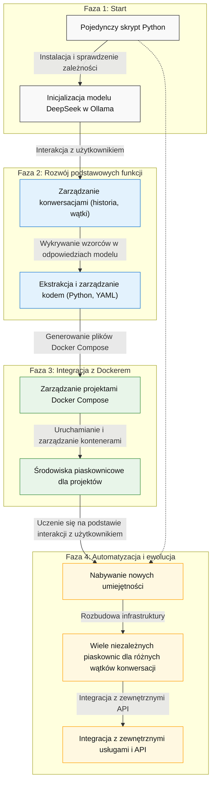

# evopy - Ewolucyjny Asystent dla konwersji text2python

Evopy to kompleksowy, ale minimalny system asystenta, który jest w stanie ewoluować z prostego skryptu konsolowego do pełnego środowiska z wieloma piaskownicami Docker. Asystent wspiera konwersję tekstu na kod Python i zarządzanie projektami w kontenerach Docker.

## Funkcjonalności

- **Automatyczna konfiguracja** - sprawdza i instaluje wymagane zależności (Docker, Ollama, model DeepSeek)
- **Interaktywny chat w konsoli** - prosty i intuicyjny interfejs użytkownika
- **Wykrywanie kodu** - automatycznie identyfikuje i obsługuje kod generowany przez model
- **Zarządzanie projektami** - tworzy i zarządza projektami w kontenerach Docker
- **Ewolucyjny rozwój** - rozbudowuje swoje możliwości w trakcie użytkowania

## Architektura

System został zaprojektowany w oparciu o architekturę ewolucyjną, która rozwija się w miarę użytkowania:




1. **Faza początkowa**: Prosty interfejs konsolowy + model DeepSeek
2. **Rozwój funkcji**: Zarządzanie konwersacjami i wykrywanie kodu w odpowiedziach
3. **Integracja z Dockerem**: Tworzenie i zarządzanie projektami Docker Compose
4. **Automatyzacja i rozszerzenia**: Nabywanie nowych umiejętności i integracje z API

## Struktura projektu

Evopy jest dostępny zarówno jako pojedynczy skrypt, jak i jako pełnoprawny pakiet Python:

```
evopy/
├── evopy/             # Katalog pakietu Python
│   ├── __init__.py    # Inicjalizacja pakietu
│   ├── evo.py         # Główny moduł asystenta
│   └── monitor.py     # Moduł monitorowania i debugowania
├── pyproject.toml    # Konfiguracja pakietu
├── environment.yml   # Konfiguracja środowiska Conda
├── requirements.txt  # Zależności Python
├── install.sh        # Skrypt instalacyjny
├── run.sh            # Skrypt uruchomieniowy
├── debug.sh          # Skrypt debugowania
└── test.sh           # Skrypt testowy
```

## Kluczowe funkcjonalności

- **Zarządzanie konwersacjami**: Każda konwersacja jest osobnym wątkiem z własną historią
- **Wykrywanie kodu w odpowiedziach**: Automatyczne wykrywanie bloków kodu Python i Docker Compose
- **Tworzenie piaskownic Docker**: Możliwość tworzenia i zarządzania piaskownicami dla każdej konwersacji
- **Uruchamianie wygenerowanego kodu**: Bezpieczne środowisko dla testowania kodu
- **Interaktywny interfejs konsolowy**: Prosty, ale funkcjonalny interfejs z kolorowymi komunikatami

## 4. Jak to działa

1. Użytkownik uruchamia skrypt `python evo.py`
2. Asystent instaluje niezbędne zależności i uruchamia model DeepSeek w Ollama
3. Użytkownik prowadzi konwersację, a asystent wykrywa kiedy generowany jest kod:
   - Dla bloków Docker Compose → proponuje utworzenie projektu
   - Dla bloków Python → proponuje zapisanie skryptu i ewentualne wykonanie

4. Z każdą konwersacją asystent zwiększa swoje możliwości, budując infrastrukturę projektów

## Zalety tego rozwiązania

1. **Minimalizm**: Startuje jako pojedynczy plik Python
2. **Samowystarczalność**: Sam instaluje potrzebne zależności
3. **Ewolucyjność**: Rozwija się w miarę używania
4. **Elastyczność**: Może pracować z różnymi modelami DeepSeek dostępnymi przez Ollama
5. **Niezależność wątków**: Każda konwersacja może mieć własne projekty i piaskownice

## Korzystanie z systemu

Pobierz wygenerowany plik `evo.py`, zainstaluj podstawowe wymagania (`pip install httpx readline`) i uruchom go. Asystent sam przeprowadzi Cię przez proces instalacji i konfiguracji, a następnie będzie ewoluował w miarę Twoich potrzeb.


# Instrukcja instalacji i użytkowania Ewolucyjnego Asystenta

## Opis

Ewolucyjny Asystent to samorozwijający się system konwersacyjny, który ewoluuje wraz z twoimi projektami. Zaczyna jako prosty skrypt Python, a z czasem rozbudowuje się o złożone funkcjonalności, takie jak zarządzanie środowiskami Docker Compose, konwersją kodu z języka naturalnego i wieloma projektami.


## Wymagania systemowe

- Python 3.8 lub nowszy
- Docker oraz Docker Compose
- Minimum 8GB RAM
- Zalecane: karta graficzna NVIDIA (dla przyśpieszenia inferencji modelu)
- Dostęp do internetu (do pobierania zależności i modeli)

## Instalacja

### Opcja 1: Standardowa instalacja

#### Krok 1: Pobierz skrypt

Najpierw zapisz kod asystenta do pliku `evo.py`:

```bash
# Pobierz plik evo.py
curl -o evo.py https://raw.githubusercontent.com/tom-sapletta-com/evopy/main/evo.py
# lub skopiuj kod z artefaktu evopy
```

#### Krok 2: Zainstaluj wymagane pakiety Python

```bash
pip install httpx readline
```

#### Krok 3: Uruchom skrypt

```bash
python evo.py
```

### Opcja 2: Instalacja jako pakiet z Miniconda

#### Krok 1: Sklonuj repozytorium

```bash
git clone https://github.com/tom-sapletta-com/evopy.git
cd evopy
```

#### Krok 2: Utwórz środowisko Conda i zainstaluj pakiet

```bash
# Utwórz środowisko z pliku environment.yml
conda env create -f environment.yml

# Aktywuj środowisko
conda activate evopy
```

#### Krok 3: Uruchom asystenta

```bash
# Uruchom bezpośrednio jako moduł
python -m evopy.evo

# Lub użyj skryptu wejściowego (po instalacji)
evopy
```

Przy pierwszym uruchomieniu asystent:
1. Sprawdzi wymagane zależności (Docker, Ollama)
2. Zaproponuje instalację brakujących komponentów
3. Pobierze i zainstaluje model DeepSeek Coder
4. Utworzy strukturę katalogów do przechowywania historii konwersacji i projektów

## Użytkowanie

### Podstawowe komendy

- **Wpisz zapytanie** - aby komunikować się z modelem
- **/help** - wyświetla dostępne komendy
- **/new** - tworzy nową konwersację
- **/list** - wyświetla listę konwersacji
- **/projects** - wyświetla projekty w aktualnej konwersacji
- **/docker ps** - wyświetla listę uruchomionych kontenerów
- **/exit** lub **/quit** - kończy działanie asystenta

### Tworzenie projektów

Możesz tworzyć projekty na dwa sposoby:

1. **Automatycznie poprzez konwersację** - gdy asystent wygeneruje kod w odpowiedzi, automatycznie zapyta o utworzenie projektu
2. **Ręcznie poprzez komendy** - możesz użyć poleceń do zarządzania projektami

### Przykładowe scenariusze użycia

#### 1. Tworzenie prostego projektu Docker Compose

```
> Stwórz prosty projekt Docker Compose z bazą danych PostgreSQL i aplikacją Flask
```

Asystent wygeneruje kod Docker Compose i zapyta czy chcesz go zapisać jako projekt. Po potwierdzeniu:
1. Utworzy katalog projektu
2. Zapisze plik docker-compose.yml
3. Zapyta czy chcesz uruchomić projekt

#### 2. Rozwijanie istniejącego projektu

```
> Dodaj do mojego projektu usługę Redis jako cache
```

Asystent przeanalizuje istniejący projekt i wygeneruje zmodyfikowaną wersję pliku Docker Compose z dodaną usługą Redis.

#### 3. Generowanie kodu Python na podstawie opisu

```
> Napisz kod w Pythonie, który łączy się z bazą danych Postgres i tworzy prostą tabelę
```

Asystent wygeneruje odpowiedni kod Python i zapyta czy chcesz go zapisać w pliku oraz w którym projekcie.

## Proces ewolucji asystenta

Asystent ewoluuje w następujących fazach:

1. **Faza początkowa**: Prosty interfejs konwersacyjny z modelem DeepSeek
2. **Rozwijanie umiejętności**: Tworzenie i zarządzanie projektami Docker Compose
3. **Integracja z infrastrukturą**: Budowanie piaskownic dla każdej konwersacji
4. **Zaawansowane funkcje**: Integracja z zewnętrznymi API i automatyzacja złożonych zadań

Za każdym razem, gdy asystent identyfikuje nowy wzorzec lub potrzebę, rozwija odpowiednią funkcjonalność.

## Struktura katalogów

```
~/.evopy/
├── cache/              # Pliki tymczasowe
├── history/            # Historia konwersacji
├── models/             # Dane modeli
├── projects/           # Projekty użytkownika
│   └── [project-id]/   # Katalog konkretnego projektu
└── config.json         # Plik konfiguracyjny
```

## Rozwiązywanie problemów

### Problemy z uruchomieniem modelu

Jeśli wystąpią problemy z uruchomieniem modelu DeepSeek Coder, spróbuj:

```bash
# Zatrzymaj wszystkie kontenery Ollama
docker stop $(docker ps -q --filter ancestor=ollama/ollama)

# Sprawdź czy Ollama działa lokalnie
ollama list

# Jeśli nie działa, uruchom ręcznie
ollama serve
```

### Problemy z projektem Docker Compose

Jeśli projekt Docker Compose nie uruchamia się poprawnie:

```bash
# Przejdź do katalogu projektu
cd ~/.evopy/projects/[project-id]

# Sprawdź logi
docker compose logs

# Zatrzymaj i usuń kontenery
docker compose down
```

## Rozszerzanie funkcjonalności

Asystent jest zaprojektowany, aby rozszerzać swoją funkcjonalność w oparciu o konwersacje. Możesz poprosić go o dodanie nowych umiejętności, na przykład:

```
> Naucz się integrować z API zewnętrznej usługi
```

lub

```
> Stwórz funkcję do automatycznego generowania testów jednostkowych dla moich skryptów Python
```

Asystent wygeneruje odpowiedni kod, który możesz dodać do jego bazy umiejętności.

## Zaawansowane użycie

### Tworzenie własnych szablonów projektów

Możesz tworzyć własne szablony projektów, które asystent będzie używał jako podstawę dla nowych projektów:

```
> Stwórz szablon projektu Django z bazą danych Postgres i Redis
```

### Integracja z zewnętrznymi API

Asystent może integrować się z różnymi API:

```
> Stwórz projekt, który będzie pobierał dane z API GitHub i zapisywał je w bazie danych
```

## Uwagi bezpieczeństwa

- Asystent uruchamia kod w izolowanych środowiskach Docker, ale zawsze sprawdzaj wygenerowany kod przed uruchomieniem
- Nie uruchamiaj niezweryfikowanego kodu na serwerach produkcyjnych
- Nie udostępniaj wrażliwych danych asystentowi

## Licencja

Ten projekt jest udostępniany na otwartej licencji Apache 2. Możesz go używać, modyfikować i rozpowszechniać zgodnie z warunkami licencji.