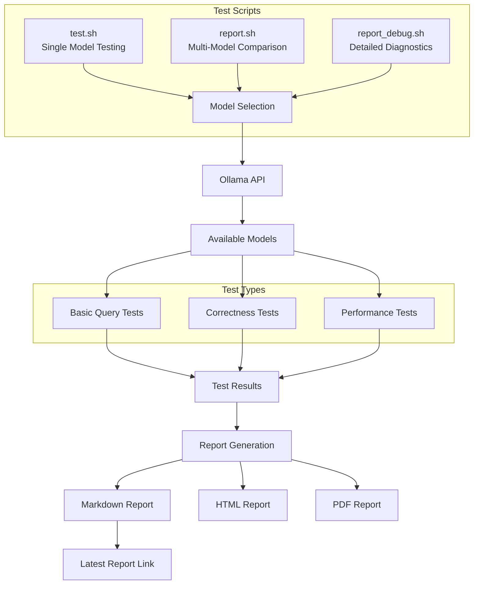
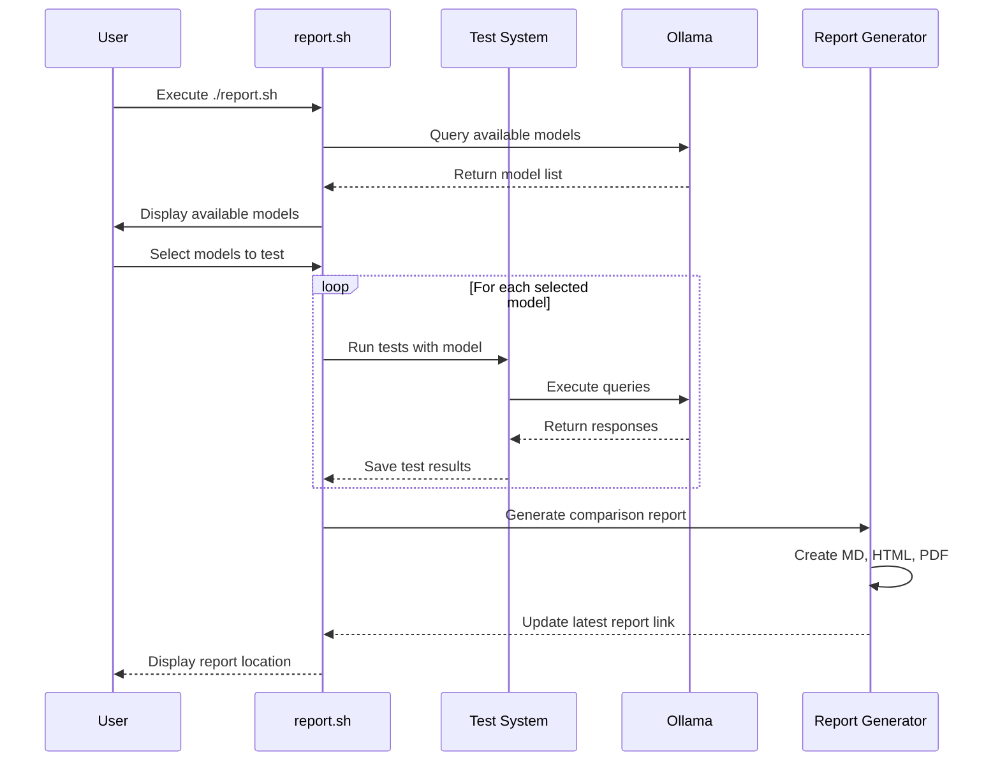
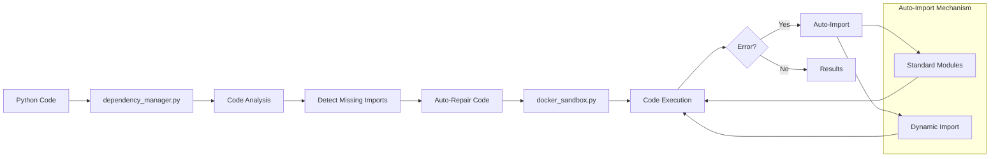

<!-- MENU_START -->
<div class="navigation-menu">
  <ul>
    <li><a href="index.md">📚 Główna dokumentacja</a></li>
    <li><a href="reports/index.md">📊 Raporty testów</a></li>
    <li class="current"><a href="TESTING.md">🧪 Instrukcja testowania</a></li>
    <li><a href="sandbox_architecture.md">🏗️ Architektura piaskownic</a></li>
    <li><a href="junior_programmer_skills.md">💻 Umiejętności programistyczne</a></li>
    <li><a href="project_guidelines.md">📝 Wytyczne projektu</a></li>
    <li><a href="cross_platform.md">🖥️ Wsparcie cross-platform</a></li>
    <li><a href="mermaid_test.md">📊 Testy diagramów Mermaid</a></li>
  </ul>
</div>
<!-- MENU_END -->
# Evopy Testing System Documentation

> **Najnowszy raport porównawczy**: [Raport porównawczy modeli LLM](../reports/comparison_report_latest.md)

## Overview

The Evopy testing system provides comprehensive testing capabilities for both the `text2python` and `python2text` modules. It allows you to test different language models (LLMs) and compare their performance, accuracy, and capabilities.

## System Architecture



## Available Scripts

### 1. `test.sh` - Single Model Testing

This script runs tests for a single model on all Evopy components.

#### Usage:

```bash
./test.sh [--model=MODEL_NAME]
```

#### Features:

- Interactive model selection at startup
- Automatic fallback to available models if the requested one isn't available
- Comprehensive testing of basic queries, correctness, and performance
- Detailed test results saved to the `test_results` directory

### 2. `report.sh` - Multi-Model Comparison

This script generates a comprehensive comparison report across multiple LLM models.

#### Usage:

```bash
./report.sh [options]
```

#### Options:

```
--model=NAME       Run tests only for the specified model
--format=FORMAT    Report format: all, md, html, pdf (default: all)
--trend=DAYS       Number of days for trend analysis (default: 30)
--compare=MODEL1,MODEL2  Compare only specified models
--metrics=METRICS  Selected metrics for analysis (default: all)
--only-report      Generate report without running tests
--help             Display help information
```

#### Features:

- Tests multiple models in sequence
- Automatically detects available models in your Ollama installation
- Generates reports in multiple formats (Markdown, HTML, PDF)
- Creates detailed comparison tables for multiple metrics categories
- Calculates performance metrics across models
- Visualizes comparisons with radar charts, bar charts, and line charts
- Tracks performance trends over time

## Generating Reports

To generate a comprehensive comparison report:

1. Run the report script with desired options:
   ```bash
   # Generate a standard report for all models
   ./report.sh
   
   # Compare only specific models
   ./report.sh --compare=llama,bielik
   
   # Generate only HTML report without running tests
   ./report.sh --format=html --only-report
   
   # Analyze trends for the last 60 days
   ./report.sh --trend=60
   ```

2. If no options are specified, you'll be prompted to select which models to test:
   - Enter specific model numbers (e.g., `1 3 5`)
   - Enter `all` to test all available models
   - Select the "All models" option

### Report Generation Process



## Dependency Auto-Repair System

Evopy includes an automatic dependency repair system that detects and fixes missing imports in code executed in Docker containers.



3. Wait for all tests to complete. This may take some time depending on the number of models selected.

4. The report will be generated in the `reports` directory with a filename like `comparison_report_YYYYMMDD_HHMMSS.md`.

## Report Structure

The enhanced report includes:

1. **Executive Summary**: Overview of the best performing models and key findings

2. **Performance Dashboard**: Comprehensive tables comparing models across multiple metrics:
   - **Overall Performance**: Basic query tests, correctness tests, performance tests, execution time, and total score
   - **Text-to-Code Conversion Accuracy**: Code correctness score, syntax error rate, semantic error rate, and prompt adherence
   - **Code Efficiency**: Time complexity, space complexity, code size efficiency, and resource usage
   - **Code Quality and Explanation**: Documentation quality, explanation clarity, code readability, and maintainability index
   - **User Intent Alignment**: Requirement fulfillment, edge case handling, user feedback, and overall alignment

3. **Visualizations**: Multiple chart types for better data interpretation:
   - **Radar Charts**: Multi-dimensional comparison of models across all metrics
   - **Bar Charts**: Comparative performance on specific metrics
   - **Line Charts**: Execution time and performance metrics

4. **Trend Analysis**: Performance trends over time for each model:
   - Progress indicators showing improvement or regression
   - Historical data analysis for key metrics

5. **Detailed Results**: For each model, comprehensive test results including:
   - Execution times and performance statistics
   - Success rates across different test categories
   - Code samples with analysis
   - Specific test case results

## Report Formats

Evopy generates reports in multiple formats:

### 1. Markdown (.md)

The primary report format with full formatting and links to all test results.

### 2. HTML

An HTML version of the report is automatically generated for web viewing. To ensure proper rendering of Mermaid diagrams in HTML, the system uses the following approach:

```html
<script src="https://cdn.jsdelivr.net/npm/mermaid/dist/mermaid.min.js"></script>
<script>
mermaid.initialize({ startOnLoad: true, theme: 'default' });
</script>
```

### 3. PDF (Landscape)

A PDF version is generated using `wkhtmltopdf` with landscape orientation for better readability of tables and diagrams.

## Viewing Reports

For the best experience viewing reports with Mermaid diagrams:

1. **Markdown**: Use a Markdown viewer that supports Mermaid (like VS Code with Markdown Preview Enhanced)
2. **HTML**: Open in any modern web browser
3. **PDF**: Open with any PDF viewer

The HTML version is recommended for the best interactive experience with diagrams.

## Troubleshooting

### Model Not Available

If a model isn't available in your Ollama installation:

1. The system will attempt to download it automatically
2. If download fails, it will fall back to an available model
3. You'll see warnings in the log about model availability

### Permission Issues

If you encounter permission issues with the `.env` file:

1. The script will notify you about the permission problem
2. Changes will only apply to the current session
3. To fix permanently, adjust permissions: `chmod u+w config/.env`

### Report Not Generated for All Models

If the report doesn't include all models:

1. **Availability**: Only models available in your Ollama installation will be tested
2. **Selection**: Ensure you've selected all desired models during the prompt
3. **Timeouts**: Long-running tests might time out; adjust the timeout in the script if needed

## Available Models

The system supports the following models:

1. **llama** - Llama 3 (default)
2. **phi** - Phi model
3. **llama32** - Llama 3.2
4. **bielik** - Bielik model
5. **deepsek** - DeepSeek Coder
6. **qwen** - Qwen model
7. **mistral** - Mistral model

Only models available in your Ollama installation will be listed for testing.

## Customizing Tests

To add new test cases or modify existing ones:

1. Edit `test_queries.py` for basic query tests
2. Edit files in `tests/correctness/` for correctness tests
3. Edit files in `tests/performance/` for performance tests

## Multi-Format Report Generation

Evopy now supports generating reports in multiple formats using the `generate_report.py` script:

### 3. `generate_report.py` - Multi-Format Report Generator

This script generates comparison reports in multiple formats from existing test results.

#### Usage:

```bash
python generate_report.py [--format=all|md|html|pdf] [--input=<results_dir>] [--output=<output_dir>]
```

#### Features:

- Generates reports in multiple formats (Markdown, HTML, PDF)
- PDF reports are generated in landscape orientation for better table display
- Automatically detects and includes all models with test results
- Creates visually enhanced HTML reports with proper styling
- Comprehensive comparison of all tested models

#### Dependencies:

To use all report formats, you'll need:
- `pandoc` - For HTML conversion
- `wkhtmltopdf` - For PDF generation

Install these dependencies with:
```bash
sudo apt-get install pandoc wkhtmltopdf
```

## Rendering and Viewing Reports

Reports can be generated and viewed in multiple formats:

1. **Markdown Format**:
   ```bash
   # Generate only markdown report
   python generate_report.py --format=md
   
   # View in terminal
   less reports/comparison_report_YYYYMMDD_HHMMSS.md
   # or with a markdown viewer
   glow reports/comparison_report_YYYYMMDD_HHMMSS.md
   ```

2. **HTML Format**:
   ```bash
   # Generate only HTML report
   python generate_report.py --format=html
   
   # Open in web browser
   xdg-open reports/comparison_report_YYYYMMDD_HHMMSS.html
   ```

3. **PDF Format (Landscape)**:
   ```bash
   # Generate only PDF report
   python generate_report.py --format=pdf
   
   # Open in PDF viewer
   xdg-open reports/comparison_report_YYYYMMDD_HHMMSS.pdf
   ```

4. **All Formats at Once**:
   ```bash
   # Generate reports in all formats
   python generate_report.py --format=all
   ```

## Best Practices

1. **Regular Testing**: Run reports periodically to track model improvements
2. **Model Comparison**: Test multiple models to find the best for your use case
3. **Test Case Coverage**: Ensure test cases cover your specific usage scenarios
4. **Performance Monitoring**: Track performance metrics over time to identify trends
