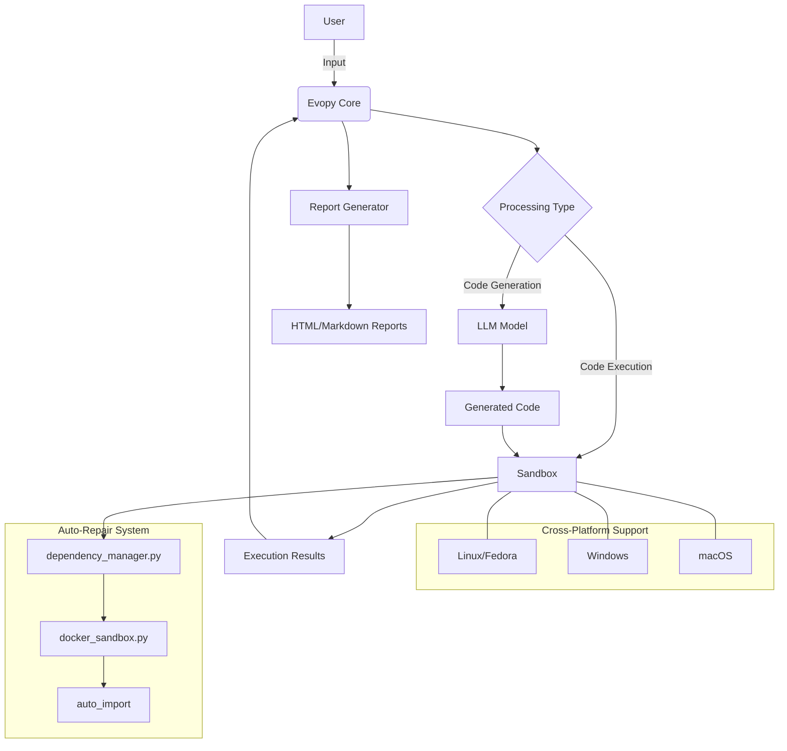
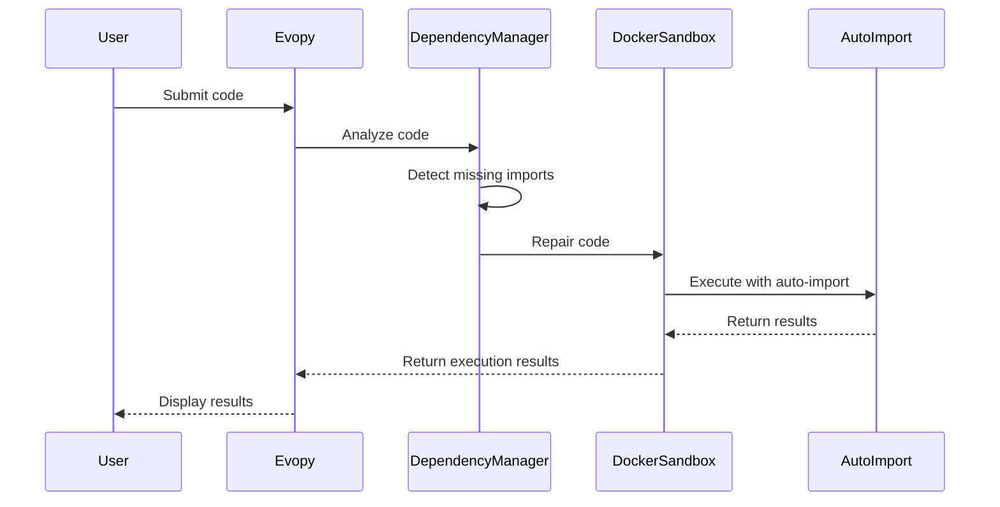

<!-- MENU_START -->
<div class="navigation-menu">
  <ul>
    <li><a href="index.md">📚 Główna dokumentacja</a></li>
    <li><a href="reports/index.md">📊 Raporty testów</a></li>
    <li><a href="TESTING.md">🧪 Instrukcja testowania</a></li>
    <li><a href="sandbox_architecture.md">🏗️ Architektura piaskownic</a></li>
    <li><a href="junior_programmer_skills.md">💻 Umiejętności programistyczne</a></li>
    <li><a href="project_guidelines.md">📝 Wytyczne projektu</a></li>
    <li class="current"><a href="cross_platform.md">🖥️ Wsparcie cross-platform</a></li>
    <li><a href="mermaid_test.md">📊 Testy diagramów Mermaid</a></li>
  </ul>
</div>
<!-- MENU_END -->
# Cross-Platform Guide for Evopy

Evopy now works seamlessly across different operating systems including Linux (Fedora), Windows 11, and macOS. This guide explains how to install and use Evopy on different platforms.

## System Architecture



## Installation

### Linux (including Fedora)

```bash
# Clone the repository
git clone https://github.com/tom-sapletta-com/evopy.git
cd evopy

# Install dependencies
python install.py

# For Fedora-specific setup
sudo ./setup_fedora.sh
```

### Windows 11

```powershell
# Clone the repository
git clone https://github.com/tom-sapletta-com/evopy.git
cd evopy

# Install dependencies (PowerShell)
.\evopy.ps1 --install

# Or using Command Prompt
evopy.bat --install
```

### macOS

```bash
# Clone the repository
git clone https://github.com/tom-sapletta-com/evopy.git
cd evopy

# Install dependencies
python install.py
```

## Usage

### Running Tests

```bash
# On Linux/macOS
./evopy.py test --model=llama --timeout=45

# On Windows (PowerShell)
.\evopy.ps1 test --model=llama --timeout=45

# On Windows (Command Prompt)
evopy.bat test --model=llama --timeout=45
```

### Generating Reports

```bash
# On Linux/macOS
./evopy.py report --all

# On Windows (PowerShell)
.\evopy.ps1 report --all
```

### Using the Sandbox

```bash
# On Linux/macOS
./sandbox_cli.py my_script.py

# On Windows (PowerShell)
.\sandbox_cli.ps1 my_script.py
```

## Dependency Auto-Repair System

Evopy includes a sophisticated dependency auto-repair system that automatically detects and fixes missing imports in code running in Docker containers. This system consists of:

1. **dependency_manager.py** - Analyzes code and adds missing imports
2. **docker_sandbox.py** - Repairs code before execution and handles dynamic imports during runtime
3. **auto_import mechanism** - Automatically imports standard modules in the execution environment

The system resolves issues like "name 'time' is not defined" and similar errors related to missing imports.

### How It Works



## Platform-Specific Features

### Linux/Fedora

- Full Docker integration
- Shell script automation
- Optimized for Linux file system

### Windows 11

- PowerShell and batch file support
- Windows-specific path handling
- Docker Desktop integration

### macOS

- Terminal integration
- Docker for Mac support
- Compatible with macOS environments

## Troubleshooting

### Common Issues

- **Model timeout errors**: Use the `--timeout` parameter to increase the time limit
- **Docker not running**: Ensure Docker is installed and running
- **Missing dependencies**: Run the installation script again with `--force` flag

### Getting Help

If you encounter any issues, please [open an issue](https://github.com/tom-sapletta-com/evopy/issues) on the GitHub repository.
