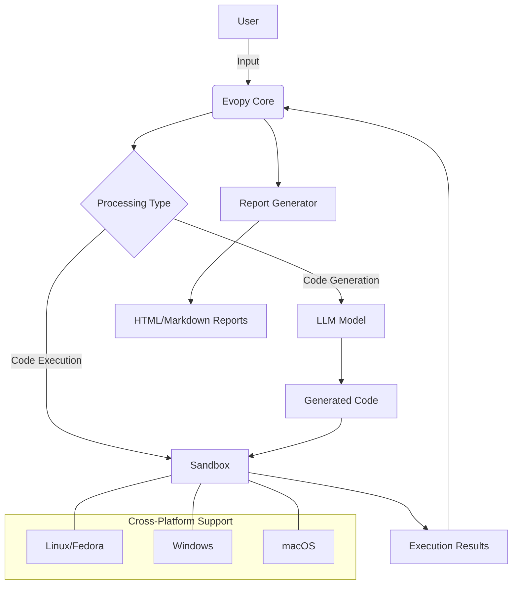

<!-- MENU_START -->
<div class="navigation-menu">
  <ul>
    <li class="current"><a href="index.md">📚 Główna dokumentacja</a></li>
    <li><a href="reports/index.md">📊 Raporty testów</a></li>
    <li><a href="TESTING.md">🧪 Instrukcja testowania</a></li>
    <li><a href="sandbox_architecture.md">🏗️ Architektura piaskownic</a></li>
    <li><a href="junior_programmer_skills.md">💻 Umiejętności programistyczne</a></li>
    <li><a href="project_guidelines.md">📝 Wytyczne projektu</a></li>
    <li><a href="cross_platform.md">🖥️ Wsparcie cross-platform</a></li>
    <li><a href="mermaid_test.md">📊 Testy diagramów Mermaid</a></li>
  </ul>
</div>
<!-- MENU_END -->
# Evopy Documentation

Evopy to kompleksowy, ale minimalny system asystenta, który jest w stanie ewoluować z prostego skryptu konsolowego do pełnego środowiska z wieloma piaskownicami Docker. Asystent wspiera konwersję tekstu na kod Python i zarządzanie projektami w kontenerach Docker.

## System Architecture



## Cross-Platform Support

Evopy now works seamlessly across different operating systems:

### Linux (including Fedora)
- Full support for all features
- Automatic dependency management
- Docker integration
- Shell script automation

### Windows 11
- PowerShell and batch file support
- Windows-specific path handling
- Docker Desktop integration
- Automatic dependency repair

### macOS
- Compatible with macOS environments
- Terminal integration
- Docker for Mac support

## Documentation Sections

- [Testing Guide](TESTING.md)
- [Sandbox Architecture](sandbox_architecture.md)
- [Mermaid Diagram Test](mermaid_test.md)

## Installation

### Cross-Platform Installation

```bash
# On Linux/macOS
python install.py

# On Windows (PowerShell)
python install.py
```

### Fedora-Specific Installation

```bash
sudo ./setup_fedora.sh
```

### Windows-Specific Installation

```powershell
# Using PowerShell
.\evopy.ps1 --install
```

## Usage

```bash
# Run tests for a specific model
./evopy.py test --model=llama3

# Generate a comparison report
./evopy.py report --all

# Clean intermediate files
./evopy.py cleanup
```

## Sandbox Usage

```bash
# Execute code in private sandbox
./sandbox_cli.py my_script.py

# Execute code with network access
./sandbox_cli.py --public my_script.py
```
