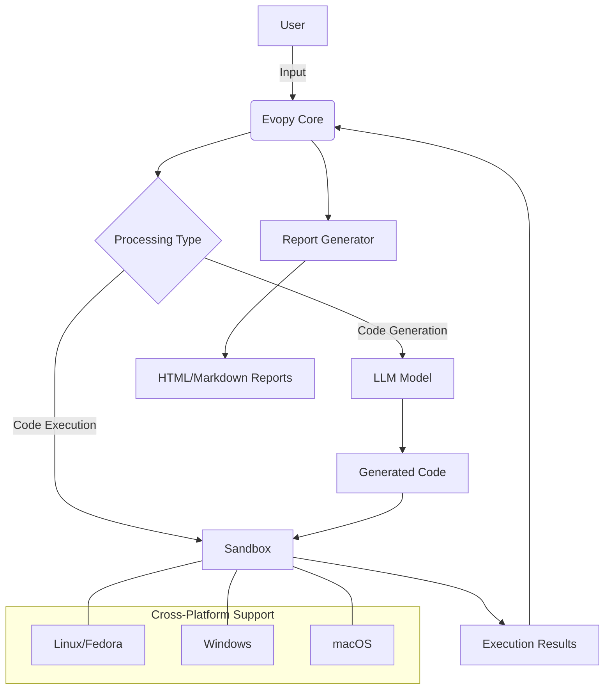
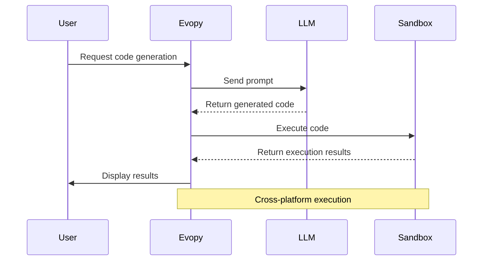

<!-- MENU_START -->
<div class="navigation-menu">
  <ul>
    <li><a href="index.md">📚 Główna dokumentacja</a></li>
    <li><a href="reports/index.md">📊 Raporty testów</a></li>
    <li><a href="TESTING.md">🧪 Instrukcja testowania</a></li>
    <li><a href="sandbox_architecture.md">🏗️ Architektura piaskownic</a></li>
    <li><a href="junior_programmer_skills.md">💻 Umiejętności programistyczne</a></li>
    <li><a href="project_guidelines.md">📝 Wytyczne projektu</a></li>
    <li><a href="cross_platform.md">🖥️ Wsparcie cross-platform</a></li>
    <li class="current"><a href="mermaid_test.md">📊 Testy diagramów Mermaid</a></li>
  </ul>
</div>
<!-- MENU_END -->
# Mermaid Diagram Test

This page demonstrates that Mermaid diagrams are properly rendering on the GitHub Pages site.

## System Architecture



## Workflow Sequence



## Component Relationships

```mermaid
classDiagram
    class EvopyCore {
        +run_tests()
        +generate_report()
        +cleanup()
    }
    
    class SandboxManager {
        +execute_in_private_sandbox()
        +execute_in_public_sandbox()
        +execute_with_dependency_repair()
    }
    
    class DockerSandbox {
        -image: string
        -timeout: int
        -memory_limit: string
        +execute(code, input_data)
    }
    
    class ReportGenerator {
        +generate_markdown_report()
        +generate_html_report()
        +generate_pdf_report()
    }
    
    EvopyCore --> SandboxManager: uses
    EvopyCore --> ReportGenerator: uses
    SandboxManager --> DockerSandbox: manages
