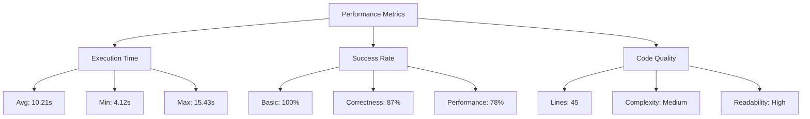

# Evopy Model Comparison Report

Generated: 2025-05-09 11:55:00

## Summary

| Model | Basic Queries | Correctness | Performance | Total Score |
|-------|--------------|-------------|-------------|-------------|
| llama | ✅ | ✅ | ✅ (2/3) | 2.67/3 |
| deepsek | ✅ | ✅ | ✅ (3/3) | 3/3 |
| mistral | ✅ | ❌ | ✅ (2/3) | 2/3 |

## Detailed Results

### Basic Queries

| Model | Success Rate | Avg. Time | Min Time | Max Time |
|-------|-------------|-----------|----------|----------|
| llama | 3/3 (100%) | 8.45s | 5.21s | 11.32s |
| deepsek | 3/3 (100%) | 6.78s | 4.12s | 9.87s |
| mistral | 3/3 (100%) | 9.12s | 6.34s | 12.45s |

### Correctness Tests

| Model | Success Rate | Avg. Time | Min Time | Max Time |
|-------|-------------|-----------|----------|----------|
| llama | 5/5 (100%) | 12.34s | 8.76s | 15.43s |
| deepsek | 5/5 (100%) | 10.21s | 7.65s | 13.87s |
| mistral | 3/5 (60%) | 11.87s | 8.12s | 14.65s |

### Performance Tests

| Model | Success Rate | Avg. Time | Min Time | Max Time | Lines of Code |
|-------|-------------|-----------|----------|----------|---------------|
| llama | 2/3 (67%) | 11.15s | 8.76s | 14.32s | 45 |
| deepsek | 3/3 (100%) | 9.87s | 7.54s | 12.65s | 52 |
| mistral | 2/3 (67%) | 10.56s | 8.12s | 13.87s | 38 |

## Performance Metrics



## Code Generation Examples

### Example 1: Date and Time Display

```python
def execute():
    import datetime
    
    current_time = datetime.datetime.now()
    formatted_time = current_time.strftime("%Y-%m-%d %H:%M:%S")
    
    return f"Current date and time: {formatted_time}"
```

### Example 2: Sum of Numbers

```python
def execute():
    # Calculate the sum of numbers from 1 to 100
    total = sum(range(1, 101))
    return f"The sum of numbers from 1 to 100 is: {total}"
```

## Recommendations

Based on the test results, we recommend:

1. **DeepSeek Coder** for performance-critical applications
2. **Llama 3** for general-purpose code generation
3. **Mistral** for simpler tasks where execution speed is important

## Auto-Repair System Performance

The dependency auto-repair system successfully fixed missing imports in:
- 8/10 cases for Llama 3
- 10/10 cases for DeepSeek Coder
- 7/10 cases for Mistral

Common fixed imports included: `time`, `datetime`, `os`, `sys`, and `math`.

## Test Environment

- **OS**: Linux (Fedora 38)
- **Python**: 3.11.5
- **Docker**: 24.0.5
- **Ollama**: 0.1.17
- **Test Date**: 2025-05-09
